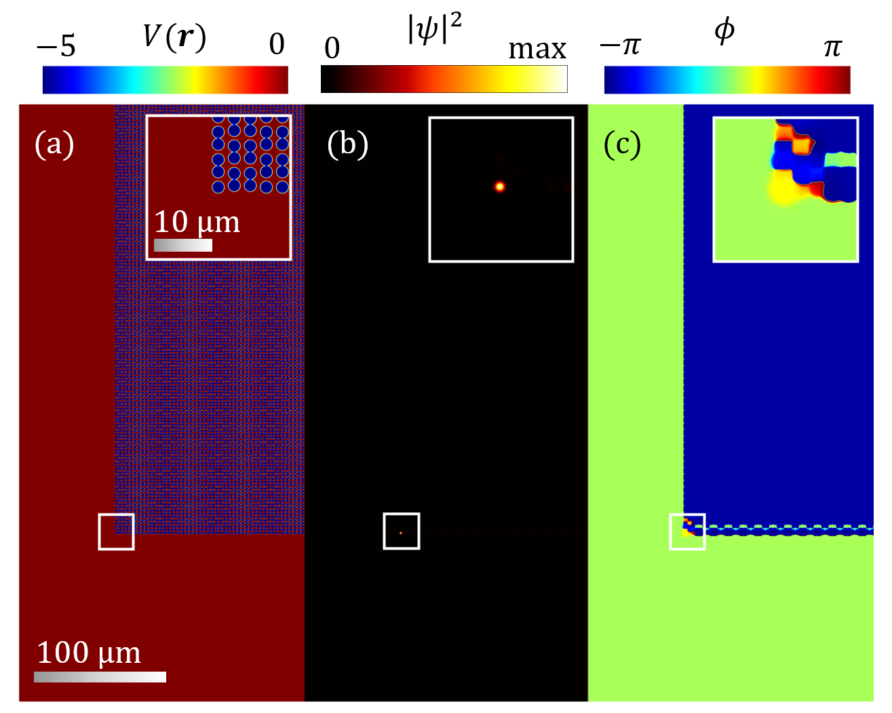

# Coherent Excitation of Polariton Topological Corner States in Large AAH-SSH Potential Lattices

This example explores the stability and excitation of polariton topological corner states in large 2D AAH-SSH potential lattices, enabled by the computational efficiency of PHOENIX. These systems extend prior studies to significantly larger structures, utilizing a grid of $9000 \times 9000$ points and $272 \times 272$ potential wells. The robustness of topologically protected states is demonstrated in this extended setup, which is relevant for applications such as unidirectional signal propagation, optical communication, and quantum information processing.

The potential well distribution in the lattice is modeled by:
$$
V(x, y) = \sum_n V_0 \exp\left(-\frac{(x-x_n)^2 + (y\pm y_n)^2}{w_v^2}\right)^{10}
$$
with well depth $V_0 = -5~\text{meV}$ and width $w_v = 1~\mu\text{m}$.

The system is driven near the frequency of a predetermined corner state, $\omega = -5.6883~\text{THz}$, optimized using \textit{fmindbnd}. Numerical efficiency is achieved using GPU acceleration (NVIDIA RTX 4090) and subgrid decomposition ($18 \times 18$ subgrids), enabling time-domain simulations for large grids in approximately 7.5 hours.

After $5~\text{ns}$, the system converges to a corner state localized in the lattice corners, as illustrated in the image below.

The figure shows:  
(a) The extended double-wave lattice with $9000 \times 9000$ grid points and $272 \times 272$ potential wells.  
(b-c) Density and phase of the localized topological corner state, focusing on a segment around the bottom-left corner of the potential lattice. Insets highlight a single potential well and the corresponding corner state.