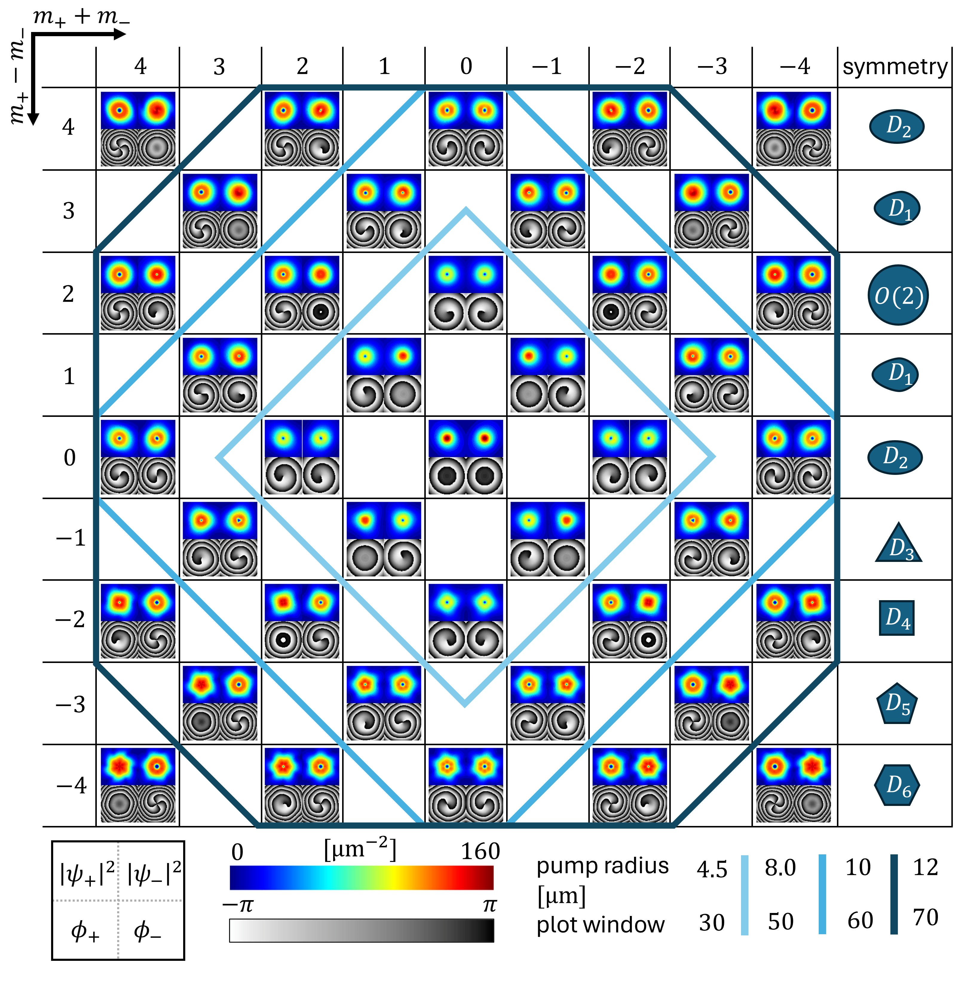

# Localized Vortices in Spinor Polariton Condensates with Spin-Orbit Coupling

This section examines the formation and stability of localized vortices in spinor polariton condensates, focusing on the effects of spin-orbit coupling. Quantized vortices in polariton condensates are characterized by phase singularities and topological charges, which give rise to quantized orbital angular momentum (OAM). These vortices have potential applications in information processing and qubit analogs, where their topological charge can serve as bit or qubit values.

Polariton condensates' spin degrees of freedom, originating from coupled exciton and photon polarization states, enable complex vortex states such as:
- **Half-quantum vortices**: A vortex in one spin component and no vortex in the other ($m_\pm \neq 0 \wedge m_\mp = 0$).
- **Full-spin vortices**: Parallel ($m_+ = m_-$) or antiparallel ($m_+ = -m_-$) vortices in both spin components.

Spin-orbit interaction, induced by TE-TM (longitudinal-transverse) splitting, couples the vortex states of the two spin components, breaking symmetry and creating diverse vortex configurations.

Numerical simulations were conducted using PHOENIX to solve the coupled equations for both spinor components ($\psi_\pm$) and their reservoirs. A $x$-linearly polarized continuous-wave pump with a ring profile was used:

$$
P_\pm(\textbf{r}) = P_0\frac{\textbf{r}^2}{w_p^2} \exp\left(\frac{\textbf{r}^2}{w_p^2}\right),
$$

with $P_0 = 100~\mu\text{m}^{-2}\text{ps}^{-1}$ and radius $w_p$.

High computational efficiency allowed systematic scanning of vortex states across various topological charge configurations ($m_+ - m_-$, $m_+ + m_-$), as shown in Fig.~\ref{fig:example3}. These simulations revealed diverse vortex patterns and their associated real-space symmetries, driven by spin-orbit coupling.

Each simulation evaluated $10~\text{ns}$ of temporal evolution on a $500 \times 500$ grid, with runtime of approximately 1 minute per run using an NVIDIA RTX 4090 GPU and AMD EPYC 7443P CPU. 

The figure shows:  
- **Grid of vortex states** arranged by the topological charge difference ($m_+ - m_-$, vertical axis) and sum ($m_+ + m_-$, horizontal axis).  
- **Density and phase distributions** of the circular polarizations for each vortex state, depicted with respective color bars.  
- **Real-space symmetries** resulting from spin-orbit interaction.  
At the bottom, a schematic shows the layout of densities and phases, with pump radii and plot window sizes for marked regions.
