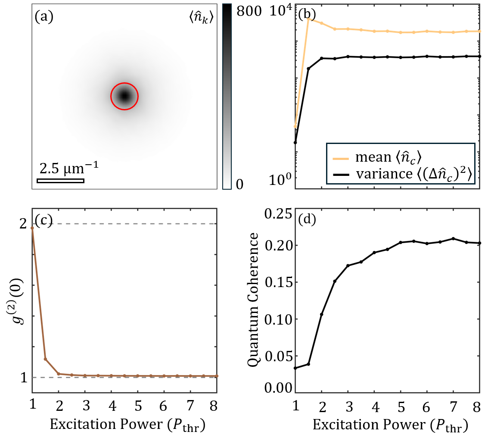

# Phase-Space Sampling and Quantum-State Tomography of Polariton Condensates with Monte Carlo Simulations

This section demonstrates how PHOENIX can analyze statistical properties of polariton condensates, including quantum coherence, using the truncated Wigner approximation (TWA). Quantum coherence provides a measure of Fock-state superpositions within the condensate, offering insights beyond traditional first- and second-order correlation functions ($g^{(1)}$ and $g^{(2)}$).

Monte Carlo methods were used to simulate stochastic differential equations incorporating quantum and classical fluctuations. PHOENIX's implementation solves these equations efficiently, allowing systematic sampling of the condensate wavefunction. The stochastic noise term is scaled by parameter $\nu$, and correlations of the complex Wiener noise are defined as:
$$
\langle dW(\textbf{r})dW(\textbf{r'})\rangle = 0, \quad 
\langle dW(\textbf{r})dW^*(\textbf{r'})\rangle = (Rn + \gamma_\mathrm{c})\frac{\delta_{\textbf{r,r'}}}{2\Delta V}.
$$

A continuous-wave pump with a super-Gaussian profile was applied:
$$
P(\textbf{r}) = P_0 \exp\left(-\frac{\textbf{r}^4}{w_p^2}\right),
$$
where $w_p = 65~\mu\text{m}$. The simulation involved $150$ repetitions, sampling wavefunctions every $5~\text{ps}$ over $1~\text{ns}$. After convergence, key properties such as polariton excitation number, $g^{(2)}(0)$, and quantum coherence $\zeta$ were evaluated for varying pump intensities.

PHOENIX performed $2250$ samples with GPU acceleration, requiring approximately 60 hours of computation. Each sample took 95 seconds on an NVIDIA RTX 4090 GPU. PHOENIX's computational efficiency allows for comprehensive statistical analyses and is extendable to quantum state tomography and density matrix reconstruction, as demonstrated in recent studies.

The figure displays:  
(a) $k$-space expectation values above the condensation threshold ($P_0 = P_\mathrm{thr}$). The red ring highlights the selected modes for analysis.  
(b) Mean and variance of the polariton excitation number as a function of excitation power in multiples of $P_\mathrm{thr}$.  
(c) Transition of $g^{(2)}(0)$ from thermal ($g^{(2)}=2$) to coherent ($g^{(2)}=1$) states with increasing excitation power.  
(d) Quantum coherence $\zeta$ as a function of excitation power, saturating around $\zeta = 0.2$.